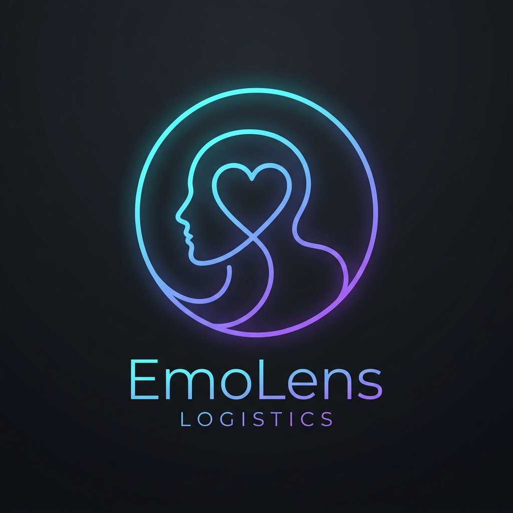

<p align="center">
  
</p>

<h1 align="center">EmoLens</h1>

<p align="center">
  <strong>AI Body-to-Emotion Translator for Neurodivergent Youth</strong>
</p>

<p align="center">
  <em>Instead of asking "How do you feel?" — a question many cannot answer —<br/>EmoLens asks "What does your body feel like?" and uses AI to bridge the gap.</em>
</p>

<p align="center">
  <a href="#-the-problem"></a>
  <a href="#-tech-stack"></a>
  <a href="#-ai-architecture"></a>
  <a href="#-ai-architecture"></a>
  <a href="#-3d-body-mapping"></a>
  <a href="#-data--privacy"></a>
</p>

<p align="center">
  <strong><a href="https://emo-lens-navy.vercel.app/">🚀 Live Demo</a></strong> · 
  <a href="#-quick-start">Quick Start</a> · 
  <a href="#-the-problem">The Problem</a> · 
  <a href="#-how-it-works">How It Works</a> · 
  <a href="#-features">Features</a> · 
  <a href="#-tech-stack">Tech Stack</a> · 
  <a href="#-ai-architecture">AI Architecture</a> · 
  <a href="#-future-scope">Future Scope</a>
</p>

---

## The Problem

### The Alexithymia Gap

**Alexithymia** — the inability to identify and describe one's own emotions — affects approximately **50% of autistic individuals**, compared to roughly 10% in the general population (Cambridge Research, 2024). For neurodivergent youth aged 10–18, this creates a devastating cascading failure:

```
Physical Sensation → Cannot Name Emotion → Cannot Communicate Distress
        → Escalation → Meltdown / Shutdown → Shame & Confusion
```

Every existing tool makes the same mistake: they ask **"How do you feel?"** — the exact question someone with alexithymia *cannot answer*. It's like asking someone who's lost their glasses to "just look harder."

### What Clinical Research Tells Us

NIH network analysis (2026) established that **"difficulty describing feelings" links directly to anxiety and depression** in neurodivergent populations. But the research also revealed a pathway forward:

> Clinical interoception research (2025–2026) has established that the pathway to emotional awareness for alexithymic individuals is **body-first, not label-first**.

The body already knows. The vocabulary is missing. **EmoLens bridges that gap.**

### The Competitive Landscape

| Existing Tool | Fatal Flaw |
|:---|:---|
| Zones of Regulation | Requires a trained therapist |
| Mightier | $50/month + proprietary hardware |
| Mood Meter | Asks "how do you feel?" (circular) |
| How We Feel | Same label-first approach |
| Generic AI Chatbots | Unscaffolded, no body awareness |

**EmoLens is the first tool to start from the body, not the label.**

---

## How It Works

EmoLens follows a clinically-informed, four-step flow that translates physical sensations into emotional vocabulary:

```
┌─────────────────┐     ┌─────────────────┐     ┌─────────────────┐     ┌─────────────────┐
│   1. TAP        │     │   2. DESCRIBE    │     │   3. MAP        │     │   4. SHARE      │
│                 │     │                  │     │                 │     │                 │
│  Select zones   │────▷│  Choose body     │────▷│  AI translates  │────▷│  Get coping     │
│  on the 3D      │     │  sensations &    │     │  sensations to  │     │  strategies &   │
│  body model     │     │  set intensity   │     │  emotions       │     │  communication  │
│                 │     │                  │     │                 │     │  cards          │
└─────────────────┘     └─────────────────┘     └─────────────────┘     └─────────────────┘
```

**Step 1 — Tap Where You Feel It:** Users interact with a 3D human body model, selecting from 12 distinct zones (head, chest, stomach, hands, etc.)

**Step 2 — Describe What You Feel:** For each zone, users select sensations — tightness, tingling, warmth, pressure, heaviness — and set intensity on a 1–5 scale

**Step 3 — AI Maps Your Emotions:** A LangGraph-powered AI pipeline analyzes the constellation of body signals and suggests 2–4 emotion hypotheses. Users confirm or remap ("None of these feel right")

**Step 4 — Share Your Way:** Get personalized coping strategies and a **Communication Card** — a shareable visual card that tells parents, teachers, or therapists *"This is what I'm feeling and what helps me"*

---

## Features

### Interactive 3D Body Mapping
- **12 clickable body zones** rendered as a low-poly 3D human model using React Three Fiber
- GSAP-powered camera zoom transitions when selecting zones
- Intensity-mapped emissive glow shaders (1–5 scale, from cool mint to warm coral)
- Supports both male and female body models with a "Change Model" option
- Automatic 2D SVG fallback if WebGL is unavailable

### AI-Powered Emotion Translation
- **LangGraph JS** stateful directed graph — not a simple chain, but a multi-node workflow with branching logic
- **Dual LLM architecture**: Gemini 3.6 Flash (primary reasoning) + Groq Llama 3.3 70B (parallel fallback)
- Human-in-the-loop: users confirm or reject suggestions with up to 2 remapping cycles
- Crisis detection: monitors for distress signals and routes to 988 Suicide & Crisis Lifeline
- Never diagnoses — always uses language like *"This might be..."*

### Personal Emotion Dictionary
- **Local-first learning engine** that maps recurring body sensation patterns to emotions over time
- Each user builds their own vocabulary — their body, their patterns, their words
- Dictionary data feeds back into AI for increasingly personalized results
- Premium glassmorphic card interface with click-to-view full details

### Communication Cards
- Exportable, shareable cards designed for non-verbal communication
- Contains: emotion label, body signals, intensity level, validation message, and personalized coping strategies
- Navigable via unique URLs — save and revisit any card
- Perfect for showing a teacher, parent, or therapist *"This is what's happening and what helps me"*

### Evidence-Based Coping Engine
- AI-generated coping strategies personalized to the specific emotion and body patterns
- Sensory-preference filtering for neurodivergent-friendly suggestions
- "Was this helpful?" feedback loop that improves suggestions over time
- Strategies include: sensory regulation, cognitive techniques, social scripting, and physical grounding

### Privacy-First Architecture
- **"Try First, Save Later"** — fully functional without any account or sign-up
- All data stored locally in IndexedDB by default
- Optional Google OAuth via Supabase for cloud sync across devices
- Supabase Row-Level Security ensures users can only access their own data
- Zero PII required at any point

---

## Tech Stack

### Frontend
| Technology | Purpose |
|:---|:---|
| **Next.js 16** (App Router) | Full-stack React framework with server-side API routes |
| **React 19** | UI component library |
| **TypeScript** | End-to-end type safety |
| **CSS Modules** | Scoped, maintainable styling with design tokens |
| **Framer Motion** | React component mount/unmount and layout animations |

### 3D Engine
| Technology | Purpose |
|:---|:---|
| **React Three Fiber v9** | Declarative Three.js inside React |
| **@react-three/drei** | Camera controls, environment lighting, HTML overlays |
| **@react-three/postprocessing** | Selective bloom and vignette effects |
| **GSAP** | Camera zoom transitions and 3D shader animations |
| **Three.js** | WebGL rendering engine |

### AI & Orchestration
| Technology | Purpose |
|:---|:---|
| **LangGraph JS** | Stateful directed graph for multi-step AI workflows |
| **Gemini 3.6 Flash** | Primary LLM for body-to-emotion reasoning |
| **Groq Llama 3.3 70B** | Parallel/fallback LLM for coping and card generation |
| **Zod** | Runtime schema validation for AI outputs |

### Data & Auth
| Technology | Purpose |
|:---|:---|
| **Supabase** (PostgreSQL) | Cloud database with Row-Level Security |
| **Supabase Auth** | Google OAuth with "Try First, Save Later" pattern |
| **IndexedDB** (via `idb`) | Local-first browser storage |
| **Zustand v5** | Client-side state management (3 dedicated stores) |

### Design & UX
| Technology | Purpose |
|:---|:---|
| **Outfit + Inter** | Google Fonts typography (headings + body) |
| **Lucide React** | Geometric line icons (zero emojis) |
| **Glassmorphism** | `backdrop-filter: blur()` glass panels throughout |
| **`prefers-reduced-motion`** | Respects OS-level motion sensitivity at engine level |

---

## AI Architecture

EmoLens uses a **LangGraph JS StateGraph** — a directed graph with persistent state, not a simple prompt chain. The graph runs server-side in Next.js API routes.

```
                    ┌──────────────┐
                    │  User Input  │
                    │  (Body Data) │
                    └──────┬───────┘
                           │
                    ┌──────▼───────┐
                    │  parseBody   │ ← Validates input + crisis detection
                    └──────┬───────┘
                           │
                  ┌────────▼────────┐
                  │  mapEmotion     │ ← Gemini 3.6 Flash (primary)
                  │                 │   Groq Llama 3.3 70B (fallback)
                  └────────┬────────┘
                           │
              ┌────────────▼────────────┐
              │  HTTP Pause             │ ← Human-in-the-loop
              │  (User selects emotion  │
              │   or requests remap)    │
              └────┬───────────────┬────┘
                   │               │
            ┌──────▼──────┐  ┌─────▼──────┐
            │ "None fit"  │  │  Selected  │
            │   Remap     │  │  Emotion   │
            │  (max 2x)   │  │            │
            └──────┬──────┘  └─────┬──────┘
                   │               │
                   └───────┬───────┘
                           │
           ┌───────────────▼───────────────┐
           │     Parallel Execution        │
           │                               │
           │  ┌─────────────────────────┐  │
           │  │  updateDictionary       │  │ ← Deterministic pattern merge
           │  │  suggestCoping          │  │ ← Groq Llama 3.3 70B
           │  │  generateCard           │  │ ← Communication card output
           │  └─────────────────────────┘  │
           └───────────────┬───────────────┘
                           │
                    ┌──────▼───────┐
                    │   Results    │
                    │   Page       │
                    └──────────────┘
```

### Dual LLM Strategy

| Model | Role | Why |
|:---|:---|:---|
| **Gemini 3.6 Flash** | Primary emotion mapping | Superior pattern recognition for complex body-sensation-to-emotion reasoning |
| **Groq Llama 3.3 70B** | Coping, cards, fallback | Ultra-fast inference for parallel tasks; automatic failover if Gemini is unavailable |

### Safety Guardrails

- **Crisis Detection**: Monitors for keywords ("hurt myself", "want to die") or 3+ max-intensity zones combined with numbness → immediately routes to **988 Suicide & Crisis Lifeline** and halts AI mapping
- **Never Diagnoses**: All suggestions are framed as hypotheses (*"This might be..."*) — never clinical labels
- **Age-Appropriate Language**: All AI output is validated against 6th–8th grade reading level
- **Prompt Injection Defense**: XML delimiter wrapping and DOMPurify sanitization
- **Rate Limiting**: Custom sliding window middleware (10 check-ins/minute per IP)

### Cost

The entire AI pipeline runs within **free tiers** of both Gemini and Groq APIs — **$0.00 infrastructure cost** for the hackathon.

---

## 3D Body Mapping

The 3D body model is the centerpiece of EmoLens — designed so that a neurodivergent teen looks at it and feels *"I can do this"*, not *"This is a medical exam."*

### Technical Specifications

| Spec | Value |
|:---|:---|
| Body zones | 12 separate meshes |
| Polygon budget | 8,000 – 15,000 triangles |
| File format | GLB (compressed) |
| Lighting rig | Key (warm 1.2) + Fill (cool 0.4) + Rim (peach 0.6) + Ambient (0.15) |
| Post-processing | Selective Bloom + Vignette |
| Target FPS | 30+ on iPhone 12 |
| Fallback | 2D SVG body map if WebGL fails |

### Zone Color System (Intensity 1–5)

| Level | Color | Hex | Meaning |
|:---|:---|:---|:---|
| 1 — Barely there | Mint | `#88d4ab` | Subtle awareness |
| 2 — Noticeable | Teal | `#8ecae6` | Clear sensation |
| 3 — Moderate | Lavender | `#b8a9c9` | Growing intensity |
| 4 — Strong | Amber | `#e6a97e` | Demanding attention |
| 5 — Overwhelming | Coral | `#d4807a` | Full saturation |

---

## Data & Privacy

### Dual Persistence Architecture

```
┌─────────────────────────────────┐
│         User Action             │
└──────────────┬──────────────────┘
               │
    ┌──────────▼──────────┐
    │    IndexedDB        │ ← Always writes here first (instant, offline-capable)
    │    (Local-first)    │
    └──────────┬──────────┘
               │
    ┌──────────▼──────────┐
    │    Supabase Cloud   │ ← Non-blocking push if authenticated
    │    (PostgreSQL)     │
    └─────────────────────┘
```

### Database Schema

| Table | Purpose |
|:---|:---|
| `profiles` | User profile with display name (auto-created on auth) |
| `checkins` | Raw check-in data (zones, sensations, intensities, context) |
| `emotion_dictionary` | Personal emotion-body pattern mappings (learning engine) |
| `coping_log` | Effectiveness feedback on coping strategies |
| `communication_cards` | Generated cards with emotion, helps, and validation |

All tables protected by **Row-Level Security (RLS)** — users can only read/write their own data.

---

## Design Philosophy

> *"Calm over clever. Everything breathes. Nothing sudden, nothing bouncy."*

| Principle | Implementation |
|:---|:---|
| **Sensory-safe** | Respects `prefers-reduced-motion`; no auto-play audio; soft lighting |
| **Zero emojis** | Emojis are ambiguous and culturally inconsistent — Lucide line icons only |
| **Glassmorphism** | Frosted glass panels with `backdrop-filter: blur()` throughout |
| **Dark mode only** | Reduced visual stimulation for sensory-sensitive users |
| **WCAG 2.1 AA** | Minimum 4.5:1 contrast ratio; 44px minimum touch targets |
| **Typography** | Outfit (headings) + Inter (body) via Google Fonts |
| **8px grid** | Consistent spacing with CSS custom properties |

---

## Project Structure

```
emolens/
├── public/
│   ├── logo.png                    # App logo
│   └── models/
│       ├── female-body.glb         # Female 3D body model
│       └── male-body.glb           # Male 3D body model
├── scripts/
│   └── migrate.mjs                 # Supabase migration runner
├── supabase/
│   └── migrations/                 # SQL schema & RLS policies
├── src/
│   ├── app/
│   │   ├── page.tsx                # Landing page
│   │   ├── checkin/                # Body check-in flow
│   │   ├── results/                # AI results & coping strategies
│   │   ├── dictionary/             # Personal emotion dictionary
│   │   ├── card/[id]/              # Shareable communication cards
│   │   ├── auth/callback/          # Supabase OAuth callback
│   │   └── api/
│   │       ├── checkin/            # LangGraph AI pipeline
│   │       ├── coping/             # Coping strategy generation
│   │       └── dictionary/         # Dictionary CRUD
│   ├── components/
│   │   ├── body/                   # 3D body model & scene
│   │   ├── checkin/                # Sensation panel & controls
│   │   ├── dictionary/             # Dictionary entry cards
│   │   ├── results/                # Emotion cards, coping cards, communication cards
│   │   ├── layout/                 # Navigation & Footer
│   │   ├── auth/                   # Auth button & provider
│   │   └── ui/                     # Reusable UI primitives
│   ├── lib/
│   │   ├── ai/                     # LangGraph graph, nodes, LLM config
│   │   ├── prompts/                # All AI system/user prompts
│   │   ├── db/                     # IndexedDB + Supabase clients & sync
│   │   ├── store/                  # Zustand state stores
│   │   ├── three/                  # Camera positions, materials, zone mapping
│   │   ├── animations/             # GSAP config, motion variants, tokens
│   │   └── utils/                  # Card export utilities
│   ├── constants/                  # Sensation vocabulary
│   ├── hooks/                      # useReducedMotion
│   └── types/                      # Database TypeScript types
└── package.json
```

---

## Quick Start

### Prerequisites

- **Node.js** 18+
- **npm** 9+
- A [Supabase](https://supabase.com) project (free tier)
- A [Google AI Studio](https://aistudio.google.com) API key (free tier)
- A [Groq](https://console.groq.com) API key (free tier)

### 1. Clone & Install

```bash
git clone https://github.com/z-lovejeet/EmoLens.git
cd EmoLens
npm install
```

### 2. Configure Environment

Create a `.env.local` file in the project root:

```env
# Supabase
NEXT_PUBLIC_SUPABASE_URL=your_supabase_url
NEXT_PUBLIC_SUPABASE_ANON_KEY=your_supabase_anon_key
SUPABASE_SERVICE_ROLE_KEY=your_service_role_key

# AI Models
GOOGLE_GENAI_API_KEY=your_gemini_api_key
GROQ_API_KEY=your_groq_api_key
```

### 3. Run Database Migrations

```bash
node scripts/migrate.mjs
```

### 4. Start Development Server

```bash
npm run dev
```

Open [http://localhost:3000](http://localhost:3000) — EmoLens is ready.

### 5. Deploy to Vercel

```bash
npm run build      # Verify build succeeds locally
```

Then deploy via [Vercel](https://vercel.com):
1. Import the GitHub repository
2. Add all environment variables from `.env.local` to the Vercel project settings
3. Deploy — Vercel auto-detects Next.js and configures everything

---

## User Personas

### Maya, 13 — Autistic + ADHD
> *"I freeze when someone asks 'what's wrong?' My meltdowns get called defiance. I need a way to show my teacher what's happening without having to find the words myself."*

**Uses EmoLens to:** Generate Communication Cards to hand to teachers during overwhelm.

### Kai, 16 — Autistic, High Alexithymia
> *"I tell my therapist everything is 'fine' or 'not fine.' There's nothing in between. Therapy feels wasted because I can't give them data."*

**Uses EmoLens to:** Build a Personal Emotion Dictionary and bring body-pattern data to therapy sessions.

### Priya, 42 — Parent
> *"I watch my son Arjun shut down and I can't reach him. I don't know if he's angry, scared, or in pain. I just want to understand."*

**Uses EmoLens to:** Receive Communication Cards from Arjun that explain what he's feeling and what helps.

---

## Performance Targets

| Metric | Target | Notes |
|:---|:---|:---|
| First Contentful Paint | < 1.5s | Optimized font loading, code splitting |
| 3D Model Load | < 3s | Compressed GLB, progressive loading |
| AI Mapping Latency | < 5s | Dual LLM with automatic failover |
| Mobile FPS | 30+ | `frameloop="demand"`, DPR capping `[1, 2]` |
| JS Bundle | < 200KB gzipped | Dynamic imports for Three.js and GSAP |
| Total Page Weight | < 5MB | Excluding 3D model assets |

---

## Resilience & Fallbacks

EmoLens is built with a 4-layer fallback architecture to ensure it **never leaves a user stranded**:

| Layer | Condition | Fallback |
|:---|:---|:---|
| **LLM Primary** | Gemini 3.6 Flash available | Full AI emotion mapping |
| **LLM Fallback** | Gemini unavailable | Auto-switch to Groq Llama 3.3 70B |
| **Static Fallback** | Both LLMs fail | Pre-mapped sensation → emotion JSON lookup table |
| **3D Fallback** | WebGL crashes or unsupported | 2D interactive SVG body map |

---

## Future Scope

### v1.1 — Enhanced Experience
- **PWA Offline Support** — Full service worker for complete offline functionality
- **PDF Therapist Export** — Generate professional reports for clinical sessions
- **Multi-language Support** — Spanish, Mandarin, Hindi localization

### v1.5 — Connected Health
- **Apple Watch Integration** — Heart rate data as additional body signal input
- **Guided Interoception Training** — Structured body-awareness exercises
- **Anonymized Community Dictionary** — Aggregate learning from opt-in users

### v2.0 — Institutional
- **School Admin Dashboard** — Aggregate wellbeing insights for student support teams
- **Therapist Portal** — Dedicated view for clinical professionals
- **Wearable Ecosystem** — Integration with biosensors and smartwatches

---

## Research Foundation

EmoLens is grounded in peer-reviewed clinical research:

- **Interoception & Alexithymia** — NIH network analysis (2026) linking "difficulty describing feelings" to anxiety/depression
- **Body-First Emotional Awareness** — Clinical interoception research (2025–2026) establishing somatic pathways for alexithymic individuals
- **Alexithymia Prevalence** — Cambridge Research (2024): ~50% of autistic individuals experience alexithymia vs. ~10% in the general population
- **TAII Framework** — Technology-Aided Instruction and Intervention systematic review for neurodivergent populations
- **Neurodiversity-Affirming Design** — Participatory co-design methodology following IncludAI criteria

---

## Hackathon

**EmoLens** is built for **IncludAI — The Neurodiversity Hackathon 2026**, Track 2: AI for Connection & Wellbeing.

Every design decision, from the body-first interaction model to the sensory-safe animations, was made with neurodivergent users at the center — not as an afterthought, but as the foundation.

> *"Every person deserves to understand their own inner world. EmoLens gives neurodivergent youth a language for what they already feel — built from their own body's signals, not borrowed from someone else's vocabulary."*

---

<p align="center">
  Built with care for neurodivergent youth everywhere.
</p>
